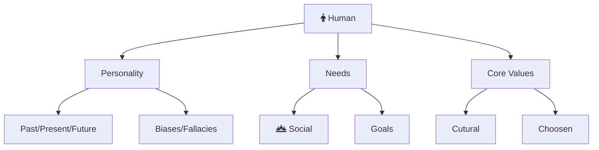



**TLDR**:

- Be healthy. Health is most important.
- Develop and rely on your core values & good habits.

[Philosophical Resources](/non-technical-resources)

These are some things that drive human behavior. I intend to cover these areas in my writing.

**Matured Essays**



**Essays on Truth**



**Incubating Essays**


