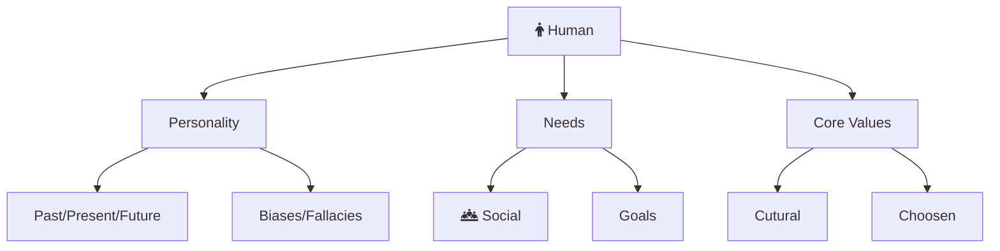



Welcome to the philosophy section. Here I dive deep into topics that affect us directly. The aim is to discover and develop practical tools to live a better life. This exploration ranges from human needs, habits, core values to communication, negotiation, and more.

The TLDR of all these articles is this:

- Be healthy. Health is most important.
- Develop and rely on good habits and core values. They provide good default fallbacks.

You can also find [Philosophical Resources](/non-technical-resources) that I hav

**Matured Essays**



## Core Values

**Introduction**


**My 7 Core Values**:

1. [Clarity](#clarity)
1. [Responsibility](#responsibility)
1. [Inputs](#inputs)
1. [Systems](#systems)
1. [Time](#time)
1. [Peace](#peace)
1. [Team Work](#teamwork)

## Clarity

**Part 1: Foundations**

1. What does clarity mean? And why is it the first core-value?
2. Why is clarity relevant?
3. Why and how clarity coincides with truth and vision?
4. What is truth? What is perspective? How multiple truths can co-exist?

**Part 2: Principles**

1. Truth and good are tied.
2. You are likely wrong.
3. The more you can look at the past and your current map. The more you'll be able to see the future.

**Part 3: Practices**

1. Structuring your thoughts. Using mental models for truth and core values for vision.

2. Spotting and navigating cognitive biases.
3. Spotting and navigating logical fallacies.

4. How to catch lies and liars? Implement Zero-Trust in real life.

5. Tell the truth. Or atleast not lie.
4. Learning to share your thoughts with others. (Intimate conversations) Why communication leads to better thinking.
5. Developing Self Awareness

Developing Vision

1. A man who thinks in decades is dangerous

**Part 4: Nuances**

1. Is it truth? Or is it panic?

## Responsibility

**Part 1: Foundations**

1. 
2. 
3. With More Responsibility Comes More Power. And with more power comes more responsibility

**Part 2: Principles**

1. Fullfill potential: The positive effect of doing hard things
2. No one gets away with anything. So actually solve the problem
3. Start now! Don't wait.(You can't wait until forever to get started. Only by starting now you'll make it easier for your future self. The problems with perfection) 

Needs vs Wants.

Nihilism of modern age. And Traditional Roles to the rescue.

#makeMistakes

Facing obstacles. And becoming antifragile.

Fuck feelings. Be disciplined.

**Part 3: Practices**

1. Start with local problems. (Clean your room)
2. Focus on needs and need to do (duties) rather than wants.
3. Stop taking on other people's responsibilities
4. Be useful and pick the heaviest load you can find.

10. Conclusion

Facing the dragon

## Inputs

**Part 1: Foundations**

1. [Need for Optimizing Inputs in the Modern World](/v1/inputs)
2. The modern struggle
3. Hinderance to everythings. The hidden cost of distraction.
4. Addition by substraction

**Part 2: Principles**

1. Traction: With right inputs you get right outputs. Automate push towards your goals.
2. Vitamin N: Say No! And accept hearing no!
3. 

**Part 3: Practices**

1. Quit: Social Media
2. Quit: Pornography
3. Quit: Sugar and Bread
4. Add: Exercise
5. Add: Meditation
6. Quit: Addictions

Embrace Boredom.

10. Conclusion

## Systems

**Part 1: Foundations**

1. 
2. Systems O(log n) over Bruteforce O(n^2)
3. Compounding effect of 1% better

Machine that makes improvements.

Knowledge repository.

Lean methodology. Kanban.

How to organize anything. (turn chaos into order)

System of people.

**Part 2: Principles**

1. Be methodical in everything.
2. Automation in the modern world
3. Be consistent.
4. Take data-driven decisions

**Part 3: Practices**

1. Post operation debrif
2. 

10. Conclusion

## Time

Avoiding procrastination

Opportunity Cost

**Part 1: Foundations**

1. 
2. Finiteness of Time
3. 

**Part 2: Principles**

1. 
2. 
3. 

**Part 3: Practices**

1. 
2. 
3. 
4. 

10. Conclusion

## Peace

Identifying emotions.

Pet a cat when you encounter one on the street.

Be grateful inspite your suffering.

#gratitude 5 minute journal.

**Part 1: Foundations**

1. 
2. 
3. Why we only see what's bad or what we did bad. Hedonic adaptation.

Time Assets Vs Liabilities

**Part 2: Principles**

1. Pleasure leads to unhappiness
2. Truth leads to peace. 
3. ROI of Fun!
4. Nature is efficient.

**Part 3: Practices**

1. Fullfilling your body. Sleep.
2. The subtle art of not giving a fuck about stupid things.
3. Learning to breathe. The art of developing detachment.
4. Let things be. The art of never hurrying.

10. Conclusion

## Team Work

**Part 1: Foundations**

1. 
2. 
3. Personalities

**Part 2: Principles**

1. We are all narcissists.
4. Learning to care
5. Random acts of kindness
6. Quit Sugar and Bread

Keep your weapons sheeth

Boundaries

Gift of attention.
Gift of empathy.
Gift of truth.

**Part 3: Practices**

4. Learning to care. Guide rather than taunt
5. Being kind and random acts of kindness.
9. Be the person everyone calls. Be useful.
10. Ask for help. People ae more caring that you realize.
11. Implement Zero Trust

10. Conclusion

space out so that people have time to adjust #changeManagement

**Incubating Essays**


