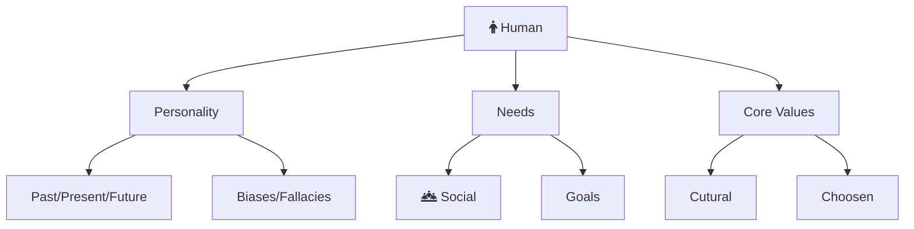



Welcome to the philosophy section. Here I dive deep into topics that affect us directly. The aim is to discover and develop practical tools to live a better life. This exploration ranges from human needs, habits, core values to communication, negotiation, and more.

The TLDR of all these articles is this:

- Be healthy. Health is most important.
- Develop and rely on good habits and core values. They provide good default fallbacks.

You can also find [Philosophical Resources](/non-technical-resources) that I hav

**Matured Essays**



## Core Values

**Introduction**


**My 7 Core Values**:

1. [Truth](#truth)
1. [Responsibility](#responsibility)
1. [Inputs](#inputs)
1. [Systems](#systems)
1. [Time](#time)
1. [Peace](#peace)
1. [Team Work](#team work)

## Truth



## Responsibility



## Inputs



## Systems



## Time



## Peace



## Team Work



**Incubating Essays**


