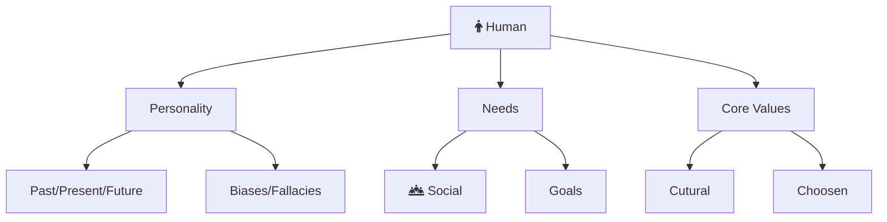

Welcome to the philosophy section. Here I dive deep into topics that affect us directly. The aim is to discover and develop practical tools to live a better life. This exploration ranges from human needs, habits, core values to communication, negotiation, and more.

The TLDR of all these articles is this:

- Be healthy. Health is most important.
- Develop and rely on good habits and core values. They provide good default fallbacks.

You can also find [Philosophical Resources](/non-technical-resources) that I found useful.

My current project is working on my core values.

## Core Values

**Introduction**


**My 7 Core Values**:

1. [Clarity](/philosophy/core-values/truth)
1. [Responsibility](/philosophy/core-values/responsibility)
1. [Inputs](/philosophy/core-values/inputs)
1. [Systems](/philosophy/core-values/systems)
1. [Time](/philosophy/core-values/time)
1. [Peace](/philosophy/core-values/peace)
1. [Team Work](/philosophy/core-values/teamwork)
1. [Adventure](/philosophy/core-values/adventure)

**Incubating Essays**


