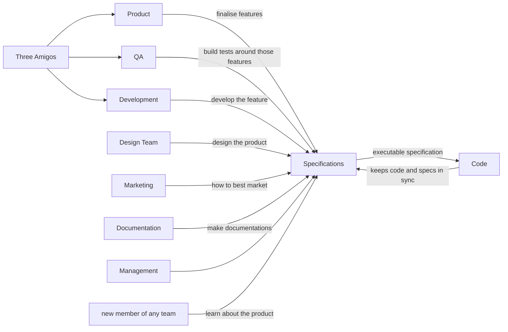

# Starting with a User's Problem

Like any product development, the primary task is to solve a user’s problem. So you should start with the user's problem and discuss how it could be solved.

This might lead to interesting approaches that could help.

Typically it’s not the most effective to bring people in a group to brainstorm because it often leads to one or two people dominating the conversation. It’s helpful to ask everyone to think about 3 points. And then take turns discussing each.

Once the problem is defined well and some solutions are agreed upon, one may start with defining features. Though typically, it’s better to validate the potential business and the solution before proceeding further.

Once the solution is finalized, you can start defining specifications.

# The document that keeps everyone in sync

The specification is a document that describes what features are to be built exactly.

This would be a single source of direction. If something is in the spec file, it has to be built that way. If it's not in the spec file, it should not be built.

The spec file keeps the entire organization in sync. 

- The product team uses it to finalize features.
- The development team used to know what to work on.
- The QA team used to build tests around those features.
- The marketing team uses it to decide how to best market.
- The documentation team uses it to create documentation.
- The design team uses it to design the product.
- A new member of any team uses it to learn about the product.

Without a specification file, everyone is confused. No one person can know everything. And even if he does it creates a bottleneck and a single point of failure if the person decides to leave the organization.

Since the spec file keeps so many people in sync, details for those specific teams should also be mentioned.

# Creation of Specifications

The creation of specifications is a collaborative process, involving different teams. Especially Product, Development, and QA, also known as the three amigos.

In reality, it's best not to start by collaborating. It’s best for a single person on the product team to write down specification files.

This is because he/she knows the business better than others and typically has effective communication skills. It’s likely not the best way to test the English skills of a developer or a tester ;). 

A product person would likely write in simple business terms that are understandable to all stakeholders. And since he/she understands best, the initial draft spec file would be out faster.

Next, the 3 Amigos can be followed to gain better clarification and add more information.

# Too many directions

A problem someone writing the spec file can face is too many branches. The team collaborates and discovers 10 different potential paths. There is no need to travel all the paths.

Though the business and solution would have been validated, real validation happens when the user starts using the product. Therefore we should limit the number of features, and for that, it’s wise not to even write details of features we think are possible or good to have. #focus

# Executable Specs

The modern way of maintaining spec files is by using feature files like Gherkin.

Gherkin provides a way to bridge the gap between what’s in the spec file and what has been developed. This is done by writing automated tests. If the test passes, we know the feature has been developed and is working.

# Specifications by Example

This also leads us to the point of how to write better specifications. The standard practice is this, described by examples. An example is how a user would interact with the system we have built. Examples solve the ambiguity. The keyword scenario is an example.

Rather than writing, a file of up to 25 MB can be uploaded. 

We can write as an example:

**Scenario**: Disallow upload of files greater than 25 MB

- **Given** I am on the file management page
- **When** I upload a 26 MB file
- **Then** the upload should fail
- **And** should not be visible in the files list

**Scenario**: Allow upload of file less than equal to 25 MB
- **Given** I am on the file management page
- **When** I upload a 25 MB file
- **Then** the file should be uploaded
- **And** visible within the files list

Therefore in the above case, two examples/scenarios were generated, success and failure.

# Behavior-Driven Development

Many other tips can make scenarios cleaner and more specific. The cleaner and more specific the scenarios are, the easier it will be for everyone to collaborate and build better products.

This whole journey encompasses BDD. BDD isn’t as specific as Test-Driven Development. The scope of BDD is much much larger and encompasses the whole product lifecycle from defining problems and validating to development and everything in between.

# More Resources:

[Questions and Answers Regarding BDD](https://specflow.org/learn/given-when-then-with-style/)