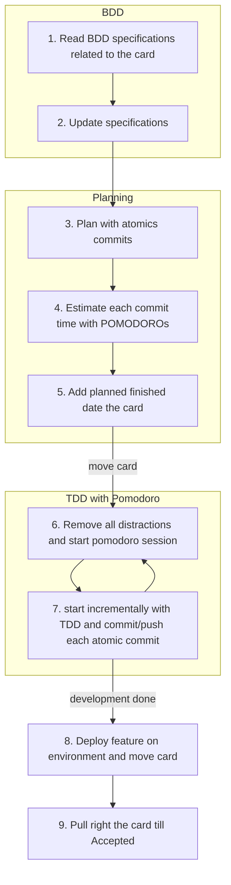

This is a value-stream mapping exercise in an effort to reduce cognitive overload and enable continous improvement.

Ideally, all these steps can be columns on a Kanban Board.

1. BDD
    1. Read BDD specifications related to the card
    2. Update specifications
2. Planning
    1. Break down card into atomic commits
    2. Estimate each commit with pomodoros
    3. Add planned finish date to the card
3. Coding
    1. Remove all distractions
    2. Move card to In-progress lane
    3. Start the [pomodoro timer](https://lazy-guy.github.io/tomodoro/index.html)
    4. Start working incrementally with TDD. Commit and push non-stop.
4. Release
    1. Manually deploy if there is no CD pipeline 
    2. Pull card towards right until accepted
    3. At end of each day, fill in card timesheet activity.