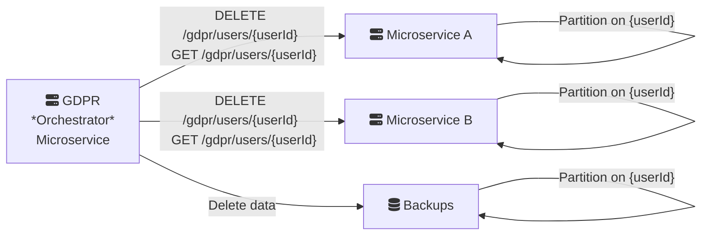

Implementing GDPR-compliant microservices to get all user data and delete a user's data can seem very hard.

But now I think it’s way too easy to implement.

The approach described below can work at the enterprise level for enterprise apps. Just replace `user` with `enterprise` and `{userId}` with `{enterpriseId}`

Essentially, we can it in 4 steps.

1. Every data record should have `{userId}` indexed. Even messaging services like Kafka with a database backup should be indexed. Even storage services like S3 be segregated as `{userId}`.
2. Have all microservices have a DELETE `/gdpr/user/{userId}` endpoint: This endpoint hard deletes all user's data
3. Have all microservices have a GET `/gdpr/user/{userId}` endpoint: This endpoint returns all data from a user
4. Have an orchestrator GDPR microservice: This will call all other microservices for `/gdpr/user/{userId}`.

In case of getting data, it will collect all the data, upload it at some location for a certain number of days and notify the user about it.

The exact same interface is needed to hard delete data from backend ups as well.

