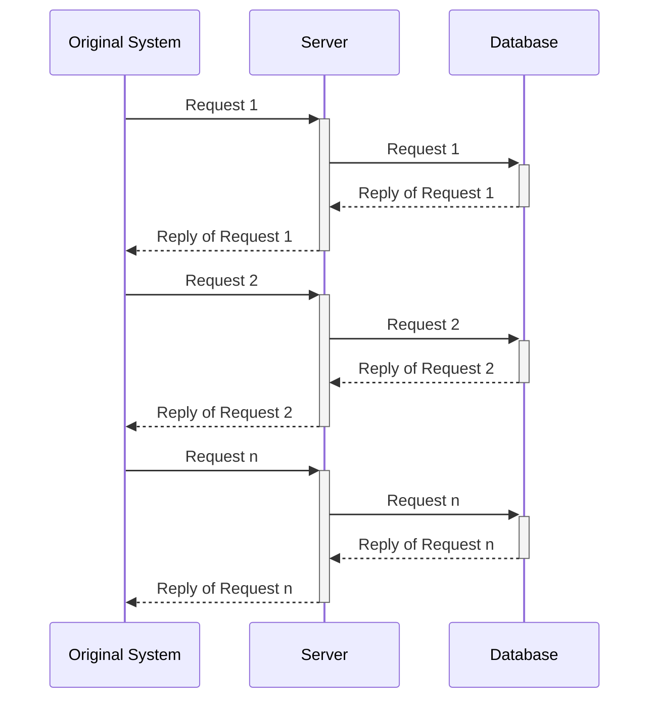
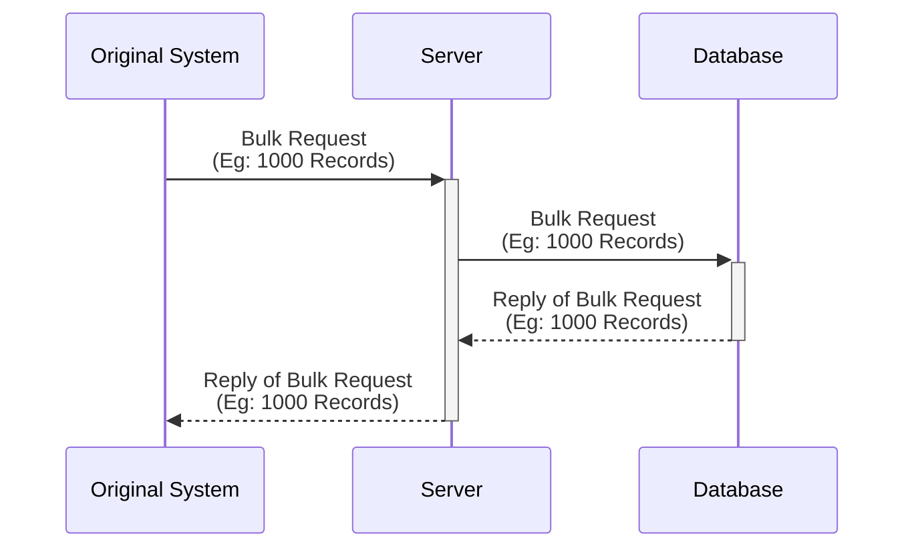
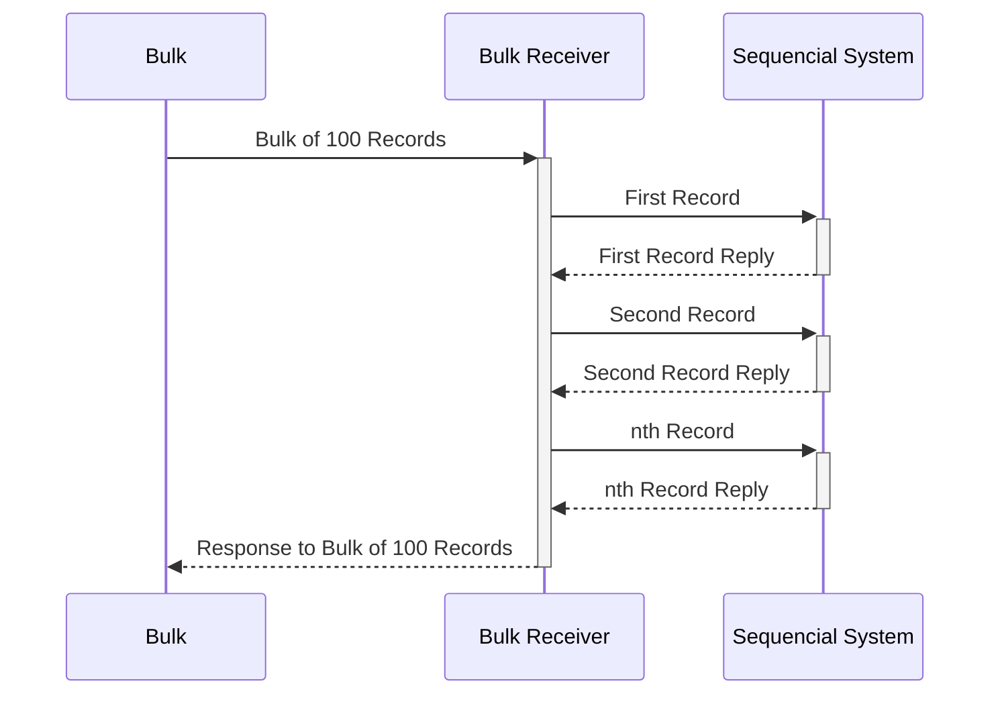
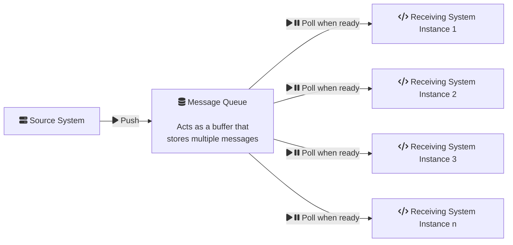

Photo by [Mika Baumeister](https://unsplash.com/pt-br/@mbaumi?utm_source=unsplash&utm_medium=referral&utm_content=creditCopyText "‌") on [Unsplash](https://unsplash.com/s/photos/big-data?utm_source=unsplash&utm_medium=referral&utm_content=creditCopyText "‌")

I published a post in [March 2023 about how typically DB migrations]([https://www.ankushchoubey.com/db-migration-script/](https://www.ankushchoubey.com/db-migration-script/ "smartCard-inline")  ) take place. The post is considered a direct migration from one DB to the other.

But sometimes, you need to do a lot of things that can only be done by the microservice that would use this data.

For example, you need to structure data in a very particular format which would be a very heavy code to remake as DB Scripts.

Or you also need to communicate with special third parties like saving data to a storage bucket which might be something microservice does already.

In such cases, you need to use your existing microservice for the migration.

This post highlights some techniques I thought of when performing such a migration. The data had lakhs of records.

## Tip 1: Create a separate endpoint for bulk

Instead of saving one record at a time, save a bunch of records at once.

This increases performance for two reasons a large part of communication is establishing a connection, sending similar metadata, and waiting for a response on a thread. When you do bulk save, you establish 1 connection instead of multiple, you send similar metadata only once instead of individually and you have only one thread waiting for a response instead of everything waiting for a response.

**Diagram of Single Request at a time**

Even multiple single requests are passed in parallel, they won't be as fast as bulk because of the number of connections that are needed to manage.

**Diagram of Bulk Request with batch of 1000**

Apart from this, databases are optimized for bulk operations, and therefore bulk operations are faster.

## Tip 2: In terms of IO, make sure everything is in bulk all processes

When doing bulk operations, you need to ensure everything in the pipeline is in bulk.

If you have twenty steps in your pipeline and 19 of them are bulk and one is sequential, then the sequential step would be a bottleneck to the whole system.

<todo add a slowness text there>

So, try to make sure every step is bulk, if you need to fetch data from the database, fetch them all at once.

If you need to save them to the database save them all at once.

Make sure all IO operations are in bulk.

## Tip 3: Make use of message queues/buffers like Kafka and leverage autoscaling of instances

If you have a large number of things to transfer, rather than migrating synchronously, you can bring a message queue in between.

The message queue will sit between the source system and the destination system. The data from the source system would be migrated to the buffer. The destination system can independently pick up resources from the buffer when it's ready and can process them.

This has the following advantage: The receiving system can autoscale.

If there are too many items in the buffer remaining to be processed, you can increase the number of instances to accommodate. Similarly, when the number of items in the buffer is less, you can scale down to a fewer number of instances.

This way multiple instances can work in parallel and only process messages when they are ready.

## Tip 4: Use feature flagging to disable features that are not needed

Hotstar is an Indian OTT platform that streams IPL, the country's most-watched sporting event. They get peak traffic of around 2.2Cr. What do they do when they are suddenly hit with all this traffic?

They do two things:

One, they increase the number of instances.

Two, they temporarily disable the number of features on the website to a minimum necessary. They call it "Panic mode".

While migrating, we can use the same principle, only enable features that are needed for the migration and disable everything else.

1. List down all the features your microservice provides
2. Go through the list and check the essential features needed.
3. Add a feature flag to disable the features.

In Spring Boot, you could use \@‌ConditionalOnProperty to declare beans when the system is not in migration.mode=true.

You may need to pair this tip up with the last tip in this post.

## Tip 5: Increase resources temporarily

Increasing the number of instances is called horizontal scaling. Increasing number the of CPU, RAM, and other resources is called vertical scaling.

In most cases, horizontal scaling would be good. But in case you need, go for vertical scaling. This would require a certain level of experimentation monitoring to decide. Monitor your microservice while performing the actions in a lower environment (dev/qa/uat).

## Tip 6: Create a temporary separate deployment of your microservice

Since you are doing feature flagging, increasing resources, having extra replicas, etc. it’s easier to manage this all by creating a separate deployment.

So, if you had a movies microservice deployment, you’ll create something like a movies-migration deployment.

The new movies-migration all the migration-specific configurations in it.

## Final Tip 7 and conclusion: Monitor your application to find bottlenecks. And do experiments to mitigate them

All the strategies above shouldn’t be used blindly, they should be used with experimentation.

Monitor your microservice while performing the migration and see, what’s the bottleneck. And try to resolve it.

If the bottleneck is the database, optimize query performance or use bulk like Tip 1.

If it’s because the service is doing extra things, feature flag it.

If it’s because there is heavy processing, increase resources.

Having an observability platform can be very useful for this sort of experimentation as you can find the bottlenecks really fast through graphs and visualizations.