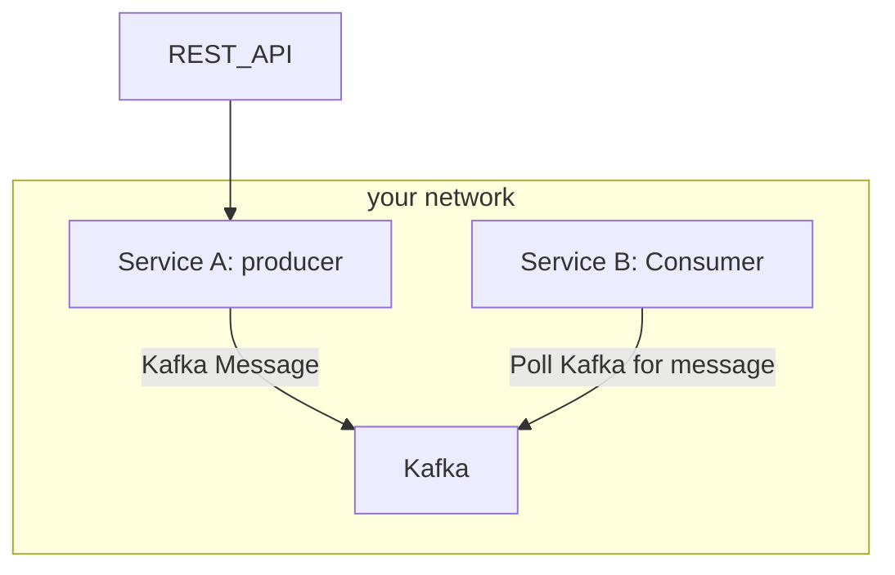
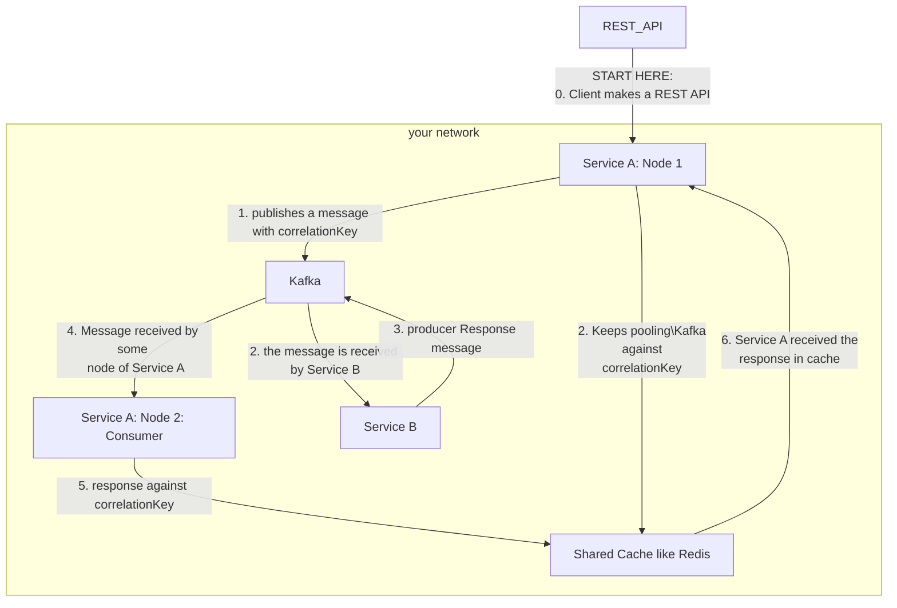

## Kafka is async

Kafka is made for asynchronous communication. It's fire and forget. Once a message is published by a producer, the producer doesn't expect a response and will move to doing some other task.

The consumer consumes the message at its will and doesn't respond back to the producer.

Ideally, this should be the case. Synchronous communication requires synchronous mediums and Kafka is not one.


[Image Source](https://aiven.io/blog/kafka-simply-explained)

However, due to some reasons that I can't explain, I had to develop a request-response scenario with Kafka. Here's how I did it.

## Correlating request and response

Each message sent by a producer would include a unique correlation-id. Once the message is received and processed by the consumer, it will publish a response message back to Kafka with the same correlation-id.

This way the producer can correlate request and response.

## Implementation details

Suppose we have two microservices, `Service A` and `Service A`. `Service A` is accessible via REST API. Whenever a request is made on `Service A` via REST, the service publishes a message on Kafka. The `Service A` is another microservice that processes the request and its own time. `Service A` is not aware of whether `Service A` has processed the request or not.

Note: `Service A` is the producer and `Service A` is the consumer.



Now, we receive a requirement that `Service A` should also respond with status of what happened on `Service A`

To make it request a response, `Service A` will also publish a message back to a Kafka, and `Service A` will consume it. In the meantime, `Service A` should wait for `Service A` to publish the message. Once `Service A` receives the message from B, it can respond back to the rest request.

The problem here is there can be many replicas of `Service A` and with Kafka, we can't predict which consumer.

_**Here are the details**_: Suppose `Service A`: Node 1 publishes a message in Kafka. Now `Service A: Node 1`. `Service A` puts the response back into Kafka. But instead of `Service A: Node 1` receiving the Kafka message, Service A: Node 2 receives the Kafka message. So, `Service A: Node 1` will never receive the Kafka message.

There are two ways to fix this:

1. Consumer Groups
2. Cache

## Consumer Group approach

Set a Kafka message key such that it'll always be processed by one microservice. This approach is much harder.

## Cache approach

When any node of `Service A` puts a Kafka message, it adds a correlation-id. The correlation-id is unique to the Kafka message that was put and the node that put it. i.e. no other node can generate the same correlation-id.

Now the `Service A` node will keep polling the shared cache to see it's there is any data against the correlationKey. If it finds any data, it'll respond back to the rest API.

When the `Service A` processes the Kafka message and puts its response back into Kafka, it'll add the same correlation-id to the response.

When any `Service A` node receives the Kafka message it'll put the message into a shared cache against the distribution key.

Here's how the cache would be:

```json
{
 "uniqueCorrelationKey": {data from kafka}
}
```

Since the `Service A` node is polling the shared cache it'll find the data against its correlationKey and send that data to the client.

While implementing this, there may be a failure of `Service A`. In this case, `Service A` will also publish an error status as a kafka message against correlationKey.

Yet, it may happen that `Service A` is unable to publish the error status. In such a case, we should introduce a timeout. This could be a few seconds like 3 or 6 after which the waiting `Service A` will timeout and return a `503 Gateway Timeout`.

And since we are adding things to the cache and that record will not be used after the timeout, we should evict the cache after the timeout time.

