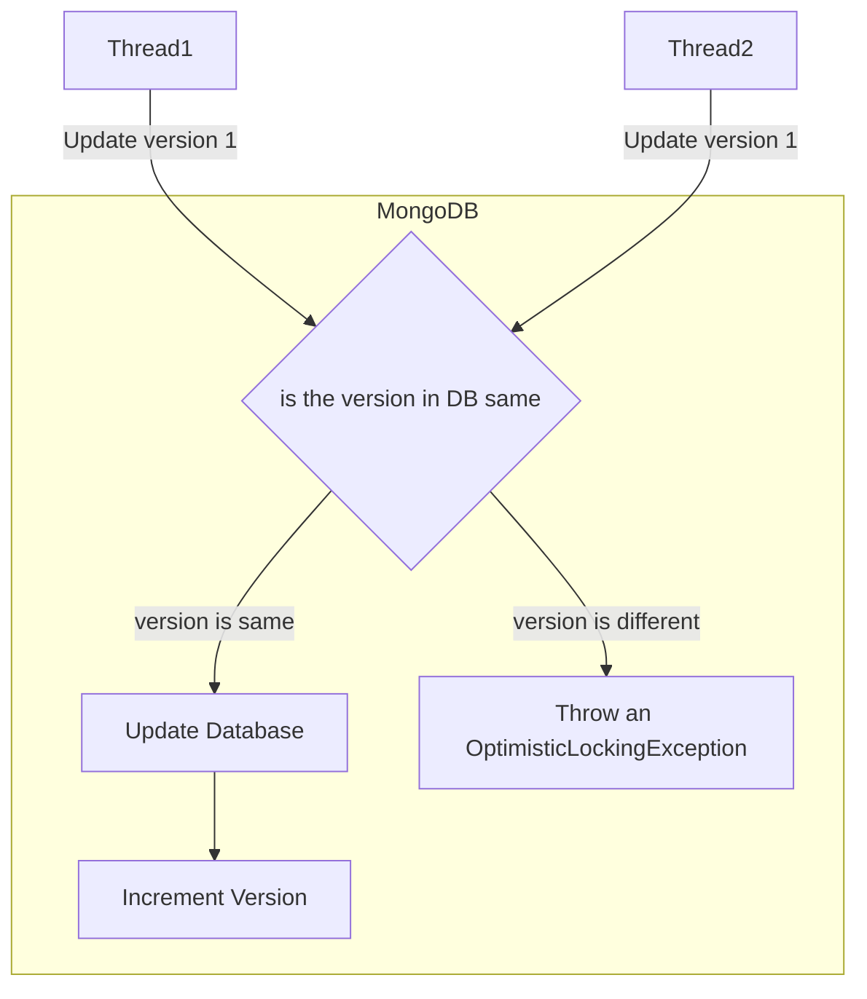



The upsert method is one of my favorite examples to teach when explaining TDD. It's simple easy and gets the point across.

This article is about backend TDD testing. The same applied to the front end but we'll see it in a different post. The example presented is using Spring Boot, but you can do this in any language.

I'll present the problem statement. Then explain the implementation while doing TDD. Later, we'll introduce a special scenario that would help us iterate on what we wrote initially.

The post can seem a bit exaggerated. In many places "good Java" practices will not be followed. A senior developer may feel a lot of explanation is unnecessary. The intent is learning and therefore, the focus of this post is to give an example that you could find relatable when you face a real problem. The blog post is therefore too detailed.

## Problem statement for **upsert**

Here's the problem statement.

You have a "movies" table in the database. The table stores all values related to a movie.  You want only one entry for each movie. If the data for a movie is present, you just update the data. If the data is not present, you insert the data. In both cases, it'll return the data from the database.

In MongoDB, terms this is called an "upsert" operation. So we'll try to write an upsert method ourselves with TDD.

## Getting Started

//TODO explain the process we will follow

### Step 1: Skeletal

To start with TDD, we first start creating the test file. But I often find it easier to decide the structure of the code first and then start writing the tests. This way I'd avoid compilation errors. At this stage, I won't write any business logic.

You think of 3 classes,

- `Movie` class. Represents a movie in the database.
- `MovieRepository` is a class used to query the database.
- `MovieService` which includes our business logic for the `upsert` method.

You go ahead and create the classes.

**Movie.java**

```java
@Entity
public class Movie {
 @Id private String movieId;
 private String movieName;
 @Version private Integer version; // We'll see the use of this @Version in the last section where we need to update our code.
}
```

**MovieRepository.java**

```java
public interface MovieRepository extends JpaRepository<Movie, String>{
 //This class is currently empty 
}
```

**MovieService**

```java
@Service
class MovieService {
 public Movie upsert(Movie movie){
  // Note how we are skipping logic and only developing skeleton code.
  return null;
 }
}
```

### Step 2: Write the failing test

We switch to tests. In IntelliJ, we have a handy shortcut, `Ctrl + Shift + T` to switch to the test or create a test file.

We created 3 classes. But we'll write the test for only one, here's why:

1. **Movie** class is just a data class. It does not include any logic.
2. **MovieRepository** is an interface that `Spring Data JPA` would implement. Spring Data JPA is an ORM. For those who don't know ORM or how `Sprint Data JPA` works, consider the `extends JpaRepository` to handle all the database-related operations like getting data from the database and saving. As this is implemented by the Spring Data JPA library, we'll not write the test for it.<Note: It's often good to confirm an external library's behavior via tests)
3. **MovieService**: This is the only class that has our business logic.

To write a skeleton test class for MovieService.

**MovieServiceTest.java**

```java
@DataMongoTest
@Import(MovieService.class)
class MovieServiceTest{
 // empty 
}
```

In TDD, we iterate on scenarios. For each scenario,

1. we start by writing a test.
2. This test fails because our code doesn't exist yet.
3. Then write the code that will pass our test.
4. This covers our one scenario.

We repeat steps 1 to 4 for each scenario. For upsert, we kind of have two scenarios.
5. If the data is not present, you insert the data.
6. If the data for a movie is present, you just update the data.

When you are doing TDD yourself, it's helpful to identify scenarios that would help you get started. I have explained the scenarios in detail here <insert link>.

Let's start with the first scenario. `If the data is not present, you insert the data.`

In the test file, I write

```java
 @Autowired MovieService movieService;
 @Autowired MovieRepository movieRepository;
 
 @Nested
 @DisplayName("upsert method")
 class UpsertMethod{
  @Nested
  @DisplayName("WHEN movie is not present")
  class WhenMovieIsNotPresent{
   @Test
   @DisplayName("SHOULD insert movie in the database")
   void shouldInsertMovieInTheDatabase(){
    // given: a movie
     Movie unsavedMovie = new Movie("M1", "Avengers");
    //When: upsert the movie
     Movie responseMovie = movieService.upsert(unsavedMovie);
    // then: movies should get saved in the database.
     Movie movieFromDatabase = movieRepository.findById(unsavedMovie.getMovieId());
     assertThat(movieFromDatabase)
      .isNotNull()
      .isEqualTo(unsavedMovie);
   }
  }
 }
}
```

The above test is purposefully written using the GIVEN/WHEN/THEN format.

Here:

1. We create a movie object.
2. We call our upsert method.
3. Then we check the database to see if the movie was inserted.

This is our first test. Note that we haven't written the code yet.

## Step 3: Run the test

We should run the test because we expect it to fail. Sometimes, when we run the test before writing the code, our tests pass.

If our test passes before writing the code, it means either we have written a bad test or that scenario was already handled.

If our test fails, it means we are doing TDD right. The tests are expected to fail. So they should fail.

## Step 3: Write the code

Now let's write the code only against the test we have written. And note more.

{It's a TDD Red Flag to write more code than what will pass the test. So only write that much code that passes the test. This way, you'll have precise code and precise tests.}

**MovieService.java**

```java
@Service
class MovieService {
 @Autowired
 MovieRepository repo;

 public Movie upsert(Movie movie){
  return repo.save(movie);
 }
}
```

Now that our code is written. As you can see, it didn't take a lot to pass our failing test. We just needed one line. But writing the test ensures that it always passes.

Sometimes, it may seem trivial to write a test for a one-liner. But stick with TDD. The goal here isn't the present. It's future maintainability as multiple developers work on the same codebase and modify behavior. Our tests ensure that our expected behavior is preserved. Later in this blog post, I'll introduce a scenario where we have to modify the test, and you'll see how the test helps.



## Step 4: Run the test

Now that the code is written, run the test and you'll hopefully see the scenario pass.

If your test doesn't pass, debug and you'll find an issue. If it's something that you don't understand, mention it in the comments below and I'll answer.

## Step 5: Repeat the write test -> run test-> write code cycle for the second scenario

Our second scenario for `upsert` was: If the data for a movie is present, you just update the data.

Here is how I'd write the failing test:

**MovieServiceTest.java**

```java
 @Nested
 @DisplayName("upsert method")
 class UpsertMethod{
  ... previous test is here
  @Nested
  @DisplayName("WHEN movie is present")
  class WhenMovieIsNotPresent{
   @Test
   @DisplayName("SHOULD update the movie in the database")
   void shouldInsertMovieInTheDatabase(){
    // given: a movie
     Movie savedMovie = movieService.upsert(new Movie("M1", "Avengers"));
     String newMovieName = "Avengers: Infinity War";
     Movie unsavedUpdatedMovie = new Movie(savedMovie.getId(), newMovieName);
    // when: upsert the movie
     Movie responseMovie = movieService.upsert(unsavedUpdatedMovie);
    // then: movies should get saved in the database.
     Movie movieFromDatabase = movieRepository.findById(responseMovie.getMovieId());
     assertThat(movieFromDatabase)
      .isNotNull()
      .isEqualTo(unsavedUpdatedMovie);
   }
  }
 }
```

I run the test and see if it's failing.

Then I write the code for updating and passing the scenario.

**MovieService.java**

```java
@Service
class MovieService {
 @Autowired
 MovieRepository repo;

 public Movie upsert(Movie movie){
  Movie movieToSave = repo.findById(movie.getId());
  if(movieToSave != null){
   movieToSave.setMovieName(movie.getName());
  } else {
   movieToSave = movie;
  }
  return repo.save(movieToSave);
 }
}
```

In the above code, we first check in the database to see if the `movie` exists.

- If it exists, we update the `movieName`.
- If it does not exist, we just save the `movie`.

This time we run all the tests in the test file to see if all of them pass. When you are developing a complex scenario, it may happen that while you are building one scenario, you break the functionality of another. Therefore running all the test scenarios would verify if the code is still working as expected.

Congratulations! You have done your first TDD cycle.

We wrote the failing test. We ran it. We wrote the code against the failing test and it passed. We repeated the cycle for the number of scenarios we had.

## A new problem

The following is a real problem I faced when the `upsert` method was run in parallel.

{This might be a bit advanced for beginner developers. If you are a beginner, read up on what locking means in parallel programming.}

Our `movie` microservice is being used by a lot of people at once. And therefore, our `upsert` method is being called many times parallelly. We have started getting MongoDB's **OptimisticLockingException**. All our tests work but they don't get the `OptimisticLockingException`.

The  `OptimisticLockingException` occurs when two different threads try to update the same row in a MongoDB database.

Pay attention to the version field below.

Suppose data in the database is `{movieId: "M1", movieName: "Avengers", version: 1}`

- This data is read by two threads:
  - The **first thread** tries to save the record as `{movieId: "M1", movieName: "Avengers: Infinity War", version: 1}`
  - The **second thread** tries to save the record as `{movieId: "M1", movieName: "Avengers: End Game", version: 1}`

The version is incremented by MongoDB only when the data is saved. Both threads are trying to update on the same version.
If one of them is saved, then the version field is incremented and the other one cannot save since it's trying to update a version that does not exist.



There are two ways to debug, one is to run the code manually and try to replicate multiple save scenarios by firing the method manually. But this is a non-TDD way.

The #WayOfTDD is, to write a test that generates the same scenario. Since I have faced this scenario before, I'll share what I had done. Below is an excerpt from my article [Solving an OptimisticLockingException During Upsert in MongoDB-Spring Webflux](https://www.ankushchoubey.com/optimistic-locking-exception-mongodb/)

I created a test as follows:

1. Manipulate documents parallel. This was done with `@RepeatableTest` and `@Execution(CONCURENT)`
2. Assertion wasn't straightforward with `@RepeatableTest` so I instead collected all versions in a static list.
3. After all `@RepeatableTests` were over I asserted if the version was as expected.
4. I ran the code and saw `OptimisticLockingException` occurring and the assertion fails.
5. I replaced `repository` `find` and `save` with `MongoOperation` `update` as described above.
6. The test passed.

```java
@Nested
@DisplayName("WHEN upsert is called parallely")
class WhenUpsertIsCalledParallelyTest{
    
    static final Long repeatTimes = 100;

    static final List<Long> allVersions = new ArrayList<>();

    @RepeatableTest(repeatTimes)                           // Part of Step 1
    @Execution(CONCURRENT)                                 // Part of Step 1
    @DisplayName("SHOULD manipulate a single record")
    void shouldManipulateASingleRecord(){
        // when:
         
            Movie movie = movieService.upsert(new Movie("M1", "Avengers")).block(); // Part of Step 1
        // data collection:
            allVersions.add(movie.getVersion());         // Part of Step 2
    }

    @AfterAll
    static void assertVersionIsRepeatTimes(){
        assertThat(Collections.max(version))                // Part of Step 3
            .isEqualTo(repeatTimes);
    }
}
```

After writing this code, I was able to reproduce the `OptimisticLockingException`

Then I modified the code like this to make it pass.

**MovieService.java**

```java
@Service
class MovieService {
 @Autowired
 MongoOperations mongoOperations;

 public Movie upsert(Movie movie){
  Update updateQuery = new Update()
   .setOnInsert("movieId", movie.getId())
   .set("movieName, movie.getName()); // code to update document
  return mongoOperation.findAndModify(
   query(where("movieId").is(movie.getId())), updateQuery, options().returnNew(true).upsert(true), Movie.class)
 }
}
```

I ran the test and the tests passed.

## Ending

What you have learned today is TDD in its purest. Hope you have practiced it step by step. If you have, do share your code's GitHub/Gitlab in the comments section.

We went from understanding the problem to developing the solution in a TDD way.

1. We created a rough skeleton.
2. We wrote a failing test for a scenario.
3. We wrote our code against the failing test enough to pass it.
4. Our test passed and we repeated the cycle for all the scenarios.

Later, we realized a new problem in our code, and replicated it,
5. We came up with a hypothesis.
6. Wrote a test to validate the hypothesis
7. Wrote the code against the test to pass it.

You have learned something that's truly the foundation of writing good code. In upcoming blog posts, we'll see how to test REST APIs, frontends, etc.

If you have any questions, suggestions, or observations or just want to connect, feel free to use the comments box below! Your knowledge-sharing will be helpful to everyone.


